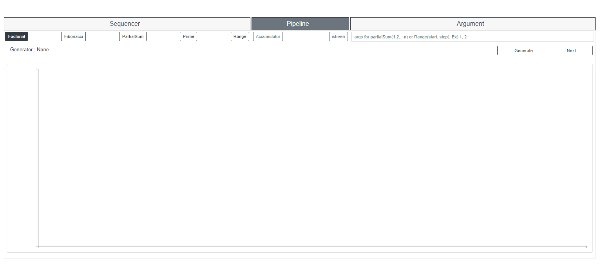
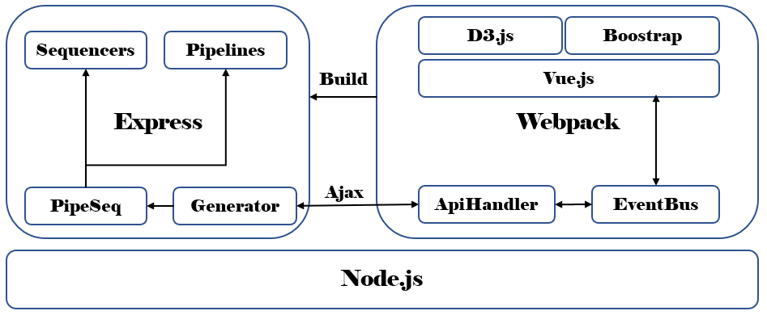

# Table of contents  
1. [Live example](#Live)
1. [About](#About)
1. [Install](#Install)
1. [Architecture](#Architecture)
1. [API](#API)
    1. [POST services/generator](#post)
    2. [GET services/generator/next](#get)
  
## Live example 
https://calm-wave-72661.herokuapp.com/

## About 
This app is working example using Express, Vue.js and D3.js by TDD style. The app generates sequence of number 
then displays them by bar chart. It also has pipeline to process sequences. Followings are list of sequencer and pipeline.

- sequencer
  - factorial
  - fibonacci
  - partialSum
  - prime
- pipeline
  - accumulator
  - isEven
    
## Install 
### Prerequisite </a>
This app uses native BigInt type. Support for arbitrarily large integers (BigInts) is a stage 3 TC39 proposal and Node 10.4.0 has BigInt support. 
> Node.js  > 10.4.0
### Deployment
This would run at http://localhost:3000
> cd backend
>
> npm install
>
> npm start

### Build 
If you change frontend, you need to build it again. The build destination folder is backend/public.
> cd frontend
> 
> npm install
>
> npm run build

### Test
run following commands at backend or frontend folder
> npm run test

## Architecture 

- Frontend (Publish–subscribe pattern)
  - ApiHandler handles all ajax calls and global { data } for Vue components. Whenever {data} is updated it publishes
matching events with data. EventBus delivers events with data to all subscribers. 
All communication is based on this method through EventBus.    
- Backend
  - POST generator api takes parameters to create sequences, then GET generator/next returns the sequence. PipeSeq creates piped sequencer object using basic sequencers and pipeline functions.
  

### API 
API uses BigInt as base number type. BigInt can't be mixed with javascript number type.
#### POST services/generator 
This api setup generator requires follower parameters in the request body.
> parameters
> { sequencer: '', pipelines: [], args: [] }
>
> 200 response ex )
>
> {"message":"factorialSeq is generated with args (), pipelines ()"}

#### GET services/generator/next 
This api returns the next value of current generator in the server. 
> 200 response ex) 
> {"value":"1"}
